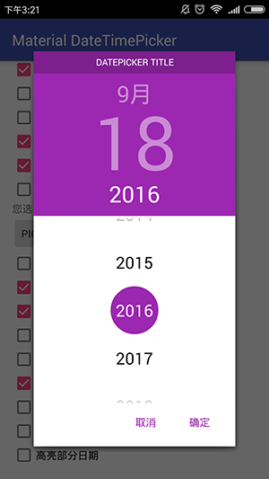
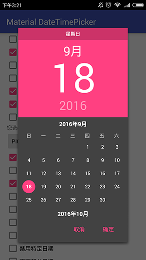
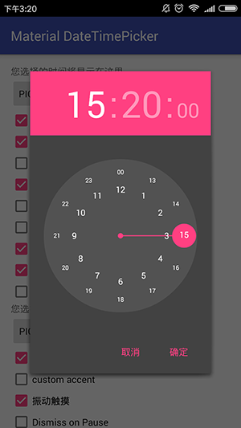

# MaterialDateTimePicker
 
 
 
 
 
## apk
[MaterialDateTimePicker-1.0.1-sample.apk](https://github.com/Sing1/MaterialDateTimePicker/blob/master/app.apk)
## gradle:
```groovy
dependencies {
    ...
    compile 'sing.materialdatetimepicker:library:1.0.1'
}
```
## Maven:
```xml
<dependency>
  <groupId>sing.materialdatetimepicker</groupId>
  <artifactId>library</artifactId>
  <version>1.0.1</version>
  <type>aar</type>
</dependency>
```
## sample
1、sample1
```xml
<com.sing.MaterialProgressBar
    style="@style/Widget.MaterialProgressBar.ProgressBar.Horizontal"
    android:layout_width="match_parent"
    android:layout_height="wrap_content"
    android:progress="30"
    android:secondaryProgress="60"
    app:mpb_progressStyle="horizontal" />
    
<style name="Widget.MaterialProgressBar.ProgressBar.Horizontal" parent="android:Widget.ProgressBar.Horizontal">
    <item name="android:indeterminateDrawable">@null</item>
    <item name="android:minHeight">16dp</item>
    <item name="android:maxHeight">16dp</item>
</style>
```
2、sapmple2
```xml
<com.sing.MaterialProgressBar
    style="@style/Widget.MaterialProgressBar.ProgressBar.Horizontal"
    android:layout_width="match_parent"
    android:layout_height="wrap_content"
    android:indeterminate="true"
    app:mpb_progressStyle="horizontal" />
<style name="Widget.MaterialProgressBar.ProgressBar.Horizontal" parent="android:Widget.ProgressBar.Horizontal">
    <item name="android:indeterminateDrawable">@null</item>
    <item name="android:minHeight">16dp</item>
    <item name="android:maxHeight">16dp</item>
</style>
```
3、sample3
```xml
<LinearLayout
    android:layout_width="match_parent"
    android:layout_height="wrap_content"
    android:gravity="center_vertical">

    <com.sing.MaterialProgressBar
        style="@style/Widget.MaterialProgressBar.ProgressBar.Large"
        android:layout_width="wrap_content"
        android:layout_height="wrap_content"
        android:indeterminate="true" />

    <com.sing.MaterialProgressBar
        style="@style/Widget.MaterialProgressBar.ProgressBar"
        android:layout_width="wrap_content"
        android:layout_height="wrap_content"
        android:indeterminate="true" />

    <com.sing.MaterialProgressBar
        style="@style/Widget.MaterialProgressBar.ProgressBar.Small"
        android:layout_width="wrap_content"
        android:layout_height="wrap_content"
        android:indeterminate="true" />
</LinearLayout>

<style name="Widget.MaterialProgressBar.ProgressBar.Large">
    <item name="android:minWidth">76dp</item>
    <item name="android:maxWidth">76dp</item>
    <item name="android:minHeight">76dp</item>
    <item name="android:maxHeight">76dp</item>
</style>
    
<style name="Widget.MaterialProgressBar.ProgressBar" parent="android:Widget.ProgressBar">
    <item name="android:indeterminateDrawable">@null</item>
    <item name="android:minWidth">48dp</item>
    <item name="android:maxWidth">48dp</item>
    <item name="android:minHeight">48dp</item>
    <item name="android:maxHeight">48dp</item>
</style>

<style name="Widget.MaterialProgressBar.ProgressBar.Small">
    <item name="android:minWidth">16dp</item>
    <item name="android:maxWidth">16dp</item>
    <item name="android:minHeight">16dp</item>
    <item name="android:maxHeight">16dp</item>
</style>
```
4、sample4
```xml
<FrameLayout
    android:layout_width="match_parent"
    android:layout_height="?actionBarSize"
    android:layout_marginBottom="6.4dp"
    android:layout_marginTop="6.4dp"
    android:background="?colorPrimary"
    android:theme="?actionBarTheme">

    <FrameLayout
        android:layout_width="match_parent"
        android:layout_height="match_parent"
        android:paddingLeft="?contentInsetStart"
        android:paddingRight="?contentInsetEnd"
        android:theme="?actionBarStyle">

        <TextView
            android:layout_width="wrap_content"
            android:layout_height="wrap_content"
            android:layout_gravity="center_vertical"
            android:text="sample4" />
    </FrameLayout>

    <com.sing.MaterialProgressBar
        android:id="@+id/horizontal_progress_toolbar"
        style="@style/Widget.MaterialProgressBar.ProgressBar.Horizontal.NoPadding"
        android:layout_width="match_parent"
        android:layout_height="wrap_content"
        android:layout_gravity="bottom"
        android:progress="30"
        android:secondaryProgress="60"
        app:mpb_progressStyle="horizontal"
        app:mpb_showTrack="false"
        app:mpb_useIntrinsicPadding="false" />
</FrameLayout>

<style name="Widget.MaterialProgressBar.ProgressBar.Horizontal.NoPadding">
    <item name="android:minHeight">3.2dp</item>
    <item name="android:maxHeight">3.2dp</item>
</style>
```
5、sample5
```xml
<FrameLayout
    android:layout_width="match_parent"
    android:layout_height="?actionBarSize"
    android:layout_marginBottom="6.4dp"
    android:layout_marginTop="6.4dp"
    android:background="?colorPrimary"
    android:theme="?actionBarTheme">

    <FrameLayout
        android:layout_width="match_parent"
        android:layout_height="match_parent"
        android:paddingLeft="?contentInsetStart"
        android:paddingRight="?contentInsetEnd"
        android:theme="?actionBarStyle">

        <TextView
            android:layout_width="wrap_content"
            android:layout_height="wrap_content"
            android:layout_gravity="center_vertical"
            android:text="sample5" />
    </FrameLayout>

    <com.sing.MaterialProgressBar
        android:id="@+id/indeterminate_horizontal_progress_toolbar"
        style="@style/Widget.MaterialProgressBar.ProgressBar.Horizontal.NoPadding"
        android:layout_width="match_parent"
        android:layout_height="wrap_content"
        android:layout_gravity="bottom"
        android:indeterminate="true"
        app:mpb_progressStyle="horizontal"
        app:mpb_showTrack="false"
        app:mpb_useIntrinsicPadding="false" />
</FrameLayout>

<style name="Widget.MaterialProgressBar.ProgressBar.Horizontal.NoPadding">
    <item name="android:minHeight">3.2dp</item>
    <item name="android:maxHeight">3.2dp</item>
</style>
```

### All 'style' are in the project, you can customize your 'style'.
